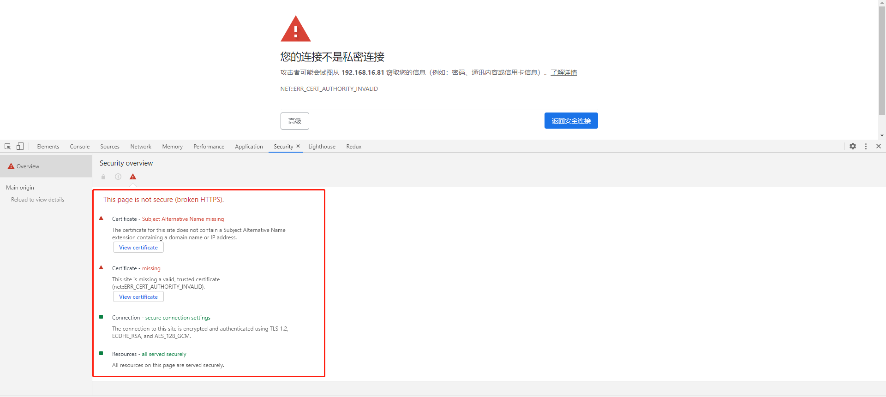
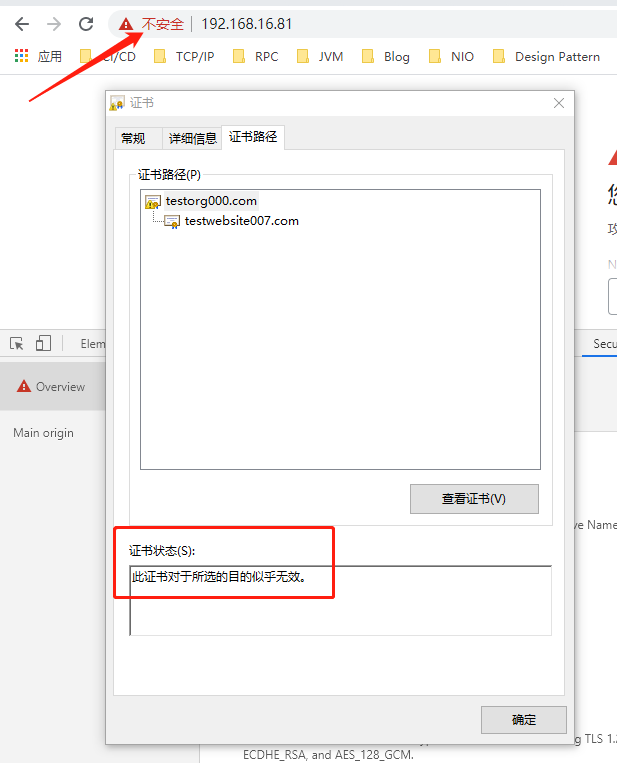

## 使用openssl自建CA的方式自签内网http服务器证书

本文的目标是使用openssl的ca方式（非x509方式），自签证书并实现http服务器的安全通信，最终实现下图的效果

## 证书签发及使用过程说明
互联网上有太多资料说明证书的使用和签发过程，其核心过程简单说明如下：

1. CA中心建立自己的软件环境，包括证书签发软件、初始化自己的私钥、初始化自己的数字证书。
2. 网站使用自己的ssl软件(此处为openssl)进行私钥生成、然后用私钥生成证书请求文件csr，将证书请求文件提交到CA处。
3. CA中心收到网站提交的csr文件，则利用CA自己的私钥和数字证书对网站的csr文件进行签发，生成网站的数字证书，并下发给网站。
4. 网站将自己的私钥以及CA签发的数字证书部署到http服务器中，并启动https服务监听。
5. 普通用户在访问网站之前，需要获得CA的数字证书，因为需要通过CA的数字证书判断网站的数字证书是否是CA签发的。一般来说，CA的数字证书为了避免造假和提交可信度，会由操作系统厂商直接安装在出场的操作系统中。如果用户自行安装CA数字证书，则需要用户自行判断CA数字证书的真实性和可靠性，本文正是由用户自行安装CA数字证书的场景。
6. 用户访问网站，因为网站使用了CA中心签发的数字证书，正常建立安全通信过程，过程略。

其中，https通信过程建立以及其他详细内容，参考文档：

```http request
https://www.cnblogs.com/xdyixia/p/11610102.html
```
### 系统环境准备
在本文中准备了两台测试环境:
CA服务器：用于签发ca证书的服务器。此处选用CentOS7.4操作系统，其他操作系统也可以。操作系统已经安装好openssl软件，如果没有安装好也可以利用yum工具安装。
Website服务器：用于使用ca证书并运行网站的web服务器。此处选用CentOS7.4操作系统，安装nginx程序以加载ca证书并实现https服务。nginx程序的安装可以利用yum或者docker方式。

### 配置ca服务器
查看openssl软件版本可以确定软件已经正确安装。
```shell
[root@ca ~]# openssl version
OpenSSL 1.0.2k-fips  26 Jan 2017
```

本文选用的是openssl的ca方式，依赖openssl的配置文件openssl.cnf，该配置文件的路径在:
```shell
/etc/pki/tls/openssl.cnf
```

可以通过vi工具查看该配置文件，其中该配置文件中的部分核心配置信息如下：

```shell
[ CA_default ]
dir             = /etc/pki/CA             # 定义路径变量
database        = $dir/index.txt          # 数据库索引文件
new_certs_dir   = $dir/newcerts           # 新签署的证书保存目录，按照下面的证书序列号进行命名
certificate     = $dir/cacert.pem         # CA自己的证书路径，该证书用于签发其他证书，并用于普通用户在访问网站时候，验证网站的数字证书是否是该CA所签发。
serial          = $dir/serial             # 当前证书序列号，后续证书会递增
private_key     = $dir/private/cakey.pem  # CA自己的私钥路径名，该私钥会被用于签发其他证书。
```

目前上述目录均是空目录
```shell
[root@ca CA]# tree -C /etc/pki/CA
/etc/pki/CA
├── certs
├── crl
├── newcerts
└── private
```

#### ca服务器openssl.cnf文件配置
首先要对ca服务器的openssl.cnf文件进行配置，否则后面自签发证书无法通过。。。。。。

##### 配置CA根证书keyUsage

修改 [ v3_req ] 节点中的keyUsage，增加 cRLSign，否则即便客户端导入CA根证书之后，也会报错认为该CA没有签发数字证书的资格。

修改前:
```shell
[ v3_req ]
...
keyUsage = nonRepudiation, digitalSignature, keyEncipherment
```

修改后:
```shell
[ v3_req ]
...
keyUsage = nonRepudiation, digitalSignature, keyEncipherment, cRLSign
```

CA服务器生成策略配置与说明：
```shell
policy          = policy_match

# For the CA policy
[ policy_match ]
countryName             = match
stateOrProvinceName     = match
organizationName        = match
organizationalUnitName  = optional
commonName              = supplied
emailAddress            = optional

# For the 'anything' policy
# At this point in time, you must list all acceptable 'object'
# types.
[ policy_anything ]
countryName             = optional
stateOrProvinceName     = optional
localityName            = optional
organizationName        = optional
organizationalUnitName  = optional
commonName              = supplied
emailAddress            = optional

```


#### ca服务器生成私钥
```shell
openssl genrsa -out pri_key.pem
```

该证书生成之后，参考上面openssl配置文件中的配置， 需要将所生成的私钥文件pri_key.pem拷贝到 /etc/pki/CA/private/ 下面并命名为 cakey.pem 文件，否则后面CA为其他请求签署证书时候会找不到自己私钥.

```shell
cp pri_key.pem /etc/pki/CA/private/cakey.pem 
```

#### 为CA生成数字证书
CA数字证书用于发送给用户，以验证网站的数字证书是否是依赖CA的数字证书所签发。

在生成CA数字证书之前，首先要生成CA数字证书的请求文件
```shell
openssl req -new -key /etc/pki/CA/private/cakey.pem -out rootCA.csr
```

其中生成过程如下：
```shell
[root@ca ca]# openssl req -new -key /etc/pki/CA/private/cakey.pem -out rootCA.csr
You are about to be asked to enter information that will be incorporated
into your certificate request.
What you are about to enter is what is called a Distinguished Name or a DN.
There are quite a few fields but you can leave some blank
For some fields there will be a default value,
If you enter '.', the field will be left blank.
-----
Country Name (2 letter code) [XX]:CN
State or Province Name (full name) []:SC
Locality Name (eg, city) [Default City]:CD
Organization Name (eg, company) [Default Company Ltd]:TESTORG
Organizational Unit Name (eg, section) []:TESTORG_CA
Common Name (eg, your name or your server's hostname) []:testorg000.com
Email Address []:

Please enter the following 'extra' attributes
to be sent with your certificate request
A challenge password []:
An optional company name []:
```

主要填写了下述几个字段:

```shell
Country Name (2 letter code) [XX]:CN                                            // 国家
State or Province Name (full name) []:SC                                        // 省
Locality Name (eg, city) [Default City]:CD                                      // 市
Organization Name (eg, company) [Default Company Ltd]:TESTORG                   // 公司
Organizational Unit Name (eg, section) []:TESTORG_CA                            // 部门
Common Name (eg, your name or your server's hostname) []:testorg000.com         // CA的域名
```

以上几个字段，在后续网站申请证书的过程中，需要根据CA服务器的openssl.cnf定义的规则进行匹配，如果要求一致但是网站证书请求中不一致的，CA会拒绝签发证书

此处就得到了CA数字证书请求文件rootCA.csr

接下来即将为CA签发自己的数字证书，该数字证书后续将用来为其他证书请求签发数字证书。在签发之前，要为CA创建数据库索引文件，否则签发要出错

```shell
touch /etc/pki/CA/index.txt 
echo "01" > /etc/pki/CA/serial
```

现在可以对CA自身的数字证书进行签发了，执行下面的命令：
```shell
openssl ca -selfsign -policy policy_anything -extensions v3_req -in rootCA.csr
```
会被询问是否确定要签发，选择回车，则签发。

执行下面的命令，可以发现CA的相关目录中签发了一个新的数字证书 01.pem，该数字证书是CA的数字证书
```shell
[root@ca ca]# tree -C /etc/pki/CA
/etc/pki/CA
├── certs
├── crl
├── index.txt
├── index.txt.attr
├── index.txt.old
├── newcerts
│   └── 01.pem
├── private
│   └── cakey.pem
├── serial
└── serial.old

4 directories, 7 files
```

现在需要将01.pem证书拷贝到openssl配置文件中定义的CA自有证书对应的路径中去，并按照配置的名称进行命名为cacert.pem文件，否则无法为其他网站签发证书，执行下面的命令：
```shell
cp /etc/pki/CA/newcerts/01.pem /etc/pki/CA/cacert.pem
```

### 网站生成私钥和证书请求文件

网站首先要生成私钥，然后利用私钥生成证书申请文件，将证书申请文件提交给CA以签发证书。网站需要自行妥善安全的保存私钥，避免泄密。

在网站自己的计算机上，利用下面的命令生成私钥：
```shell
openssl genrsa -out key.pem 2048
```

然后利用下面的命令生成证书申请文件csr
```shell
openssl req -new -days 365 -key key.pem -out website_req.csr
```

生成过程中输入的参数如下:

```shell
[root@website ~]# openssl req -new -days 365 -key key.pem -out website_req.csr
You are about to be asked to enter information that will be incorporated
into your certificate request.
What you are about to enter is what is called a Distinguished Name or a DN.
There are quite a few fields but you can leave some blank
For some fields there will be a default value,
If you enter '.', the field will be left blank.
-----
Country Name (2 letter code) [XX]:CN
State or Province Name (full name) []:SC
Locality Name (eg, city) [Default City]:CD
Organization Name (eg, company) [Default Company Ltd]:TESTWEBSITE_ORG
Organizational Unit Name (eg, section) []:DEV
Common Name (eg, your name or your server's hostname) []:testwebsite007.com
Email Address []:

Please enter the following 'extra' attributes
to be sent with your certificate request
A challenge password []:
An optional company name []:

```

网站可以通过任何安全的渠道将上一步所生成的证书申请文件website_req.csr发送给CA中心，一般是通过网页上传、电子邮件等方式。


### CA中心为网站签发证书
CA中拿到网站所提交的website_req.csr证书申请文件之后，可以为网站签发证书。

```shell
openssl ca -policy policy_anything -extensions v3_req -in website_req.csr
```

执行成功之后，可以看到ca中心的机器上生成了02.pem文件：
```shell
[root@ca ca]# tree -C /etc/pki/CA
/etc/pki/CA
├── cacert.pem
├── certs
├── crl
├── index.txt
├── index.txt.attr
├── index.txt.attr.old
├── index.txt.old
├── newcerts
│   ├── 01.pem
│   └── 02.pem
├── private
│   └── cakey.pem
├── serial
└── serial.old

4 directories, 10 files
```

02.pem就是CA中心为网站所签发的数字证书文件，可以通过受信任的渠道发送给用户。

### 网站利用CA中心所签发的数字证书进行SSL加密
当网站获得CA中心所签发的数字证书之后，则可以对自己所提供的http服务进行加密了(https)。

参下面的nginx配置片段：

```shell
    server {
        listen 443 ssl;
        server_name testwebsite007.com;
        root /usr/share/nginx/html;
        ssl_certificate                 /opt/ssl/02.pem;
        ssl_certificate_key             /opt/ssl/key.pem;
        ssl_session_timeout 5m;
        ssl_protocols TLSv1 TLSv1.1 TLSv1.2;
        ssl_ciphers ECDHE-RSA-AES128-GCM-SHA256:HIGH:!aNULL:!MD5:!RC4:!DHE;
        ssl_prefer_server_ciphers on;

        error_page 400 404 500 502 503 504 /50x.html;
            location = /error {
                root /usr/share/nginx/html/40x.html;
            }
    }
```

相关的配置信息均可以在网上关于nginx的配置介绍中查询到，关于数字证书配置的要关注下面两行:
```shell
        ssl_certificate                 /opt/ssl/02.pem;                  // 数字证书
        ssl_certificate_key             /opt/ssl/key.pem;                 // 数字证书对应的私钥
```

网站可以利用上面的配置启动https服务，要关注一下系统日志中是否有配置路径错误等信息，保证正确启动。

### 用户访问网站
此时，用户已经可以访问该网站

#### 首先导入CA证书
登录到CA服务器上，拷贝之前CA生成的数字证书给用户，可以用sftp或者其他安全的方式。CA的数字证书路径为：
```shell
/etc/pki/CA/cacert.pem
```

然后打开chrome浏览器，依次选择：

```shell
设置->隐私设置和安全性->安全->管理证书->受信任的根证书颁发机构->导入
```

然后找到CA服务器提供的cacert.pem证书，注意浏览器默认的扩展名没有.pem的，在导入的时候要切换到所有文件，然后选择cacert.pem，然后导入的目标记得选择：受信任的根证书颁发机构


### 常见错误排除

在自行签发证书并通过https访问的过程中，还是又不少问题的，排除问题最常用的办法是在chrome浏览器的开发者调试工具中，选择security标签。如下图：



#### 错误1 Certificate - Subject Alternative Name missing

Certificate - Subject Alternative Name missing
错误是要求数字证书必须提供除了Common Name对应的域名之外的第二个域名。

#### 错误2 Certificate - missing
Certificate - missing
This site is missing a valid, trusted certificate (net::ERR_CERT_AUTHORITY_INVALID).
该错误表示，没有足够的CA信息来证明所访问网站的证书是可靠的。表明没有导入CA证书。

注意，在导入CA证书之后，依然有可能继续报上面的错误，此时要在浏览器的不安全感叹号上点右键，然后选择证书，然后选择证书路径。会发现已经识别到CA证书，说明网站的证书是由CA机构签发的，但是点击根证书会发现错误: 此证书对于所选的目的似乎无效。如下图所示：



该错误的原因是因为没有在openssl.cnf 中配置正确的目的，参见：


